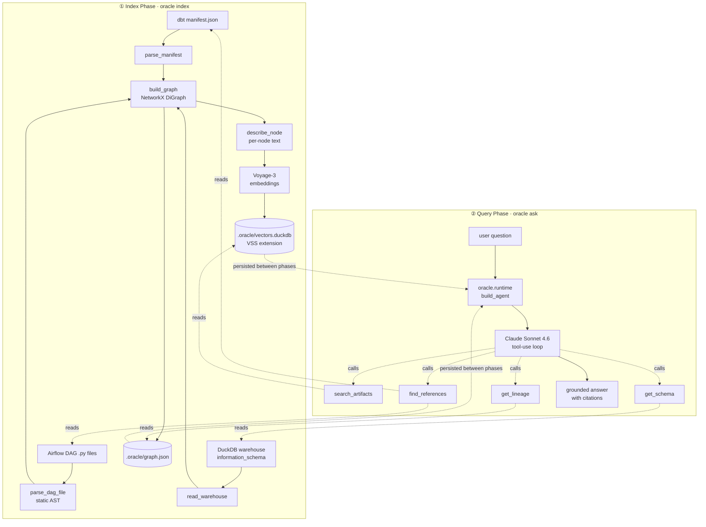

# Architecture

Lineage Oracle answers questions about a data warehouse with grounded citations. It does this by combining a **structural lineage graph** (NetworkX, derived from real artifacts) with a **semantic vector index** (Voyage-3 embeddings stored in DuckDB), and exposing both to a Claude Sonnet 4.6 tool-use agent.

This document explains how the pieces fit together. For requirements and design rationale, see [`superpowers/specs/2026-05-06-lineage-oracle-design.md`](./superpowers/specs/2026-05-06-lineage-oracle-design.md). For the task-by-task implementation history, see [`superpowers/plans/2026-05-06-lineage-oracle.md`](./superpowers/plans/2026-05-06-lineage-oracle.md).

---

## Two phases

The system has a clean split between **building knowledge** and **answering questions**. Each phase has its own entry point and persists to or reads from the same `.oracle/` artifact directory.



---

## Components

### `oracle/ingest/` — Source parsers

Each parser is a pure function: file in, typed dataclass out. No graph or LLM concerns leak in.

| Module | Input | Output | Notes |
|---|---|---|---|
| `dbt.py` | `manifest.json` | `DbtManifest(nodes: list[DbtNode])` | Reads the JSON dbt already produced; never invokes dbt |
| `airflow.py` | DAG `.py` files | `AirflowDag` | **Static** AST parse — does not import or run the DAG |
| `warehouse.py` | DuckDB file | `Warehouse(tables: list[WarehouseTable])` | Queries `information_schema` |

### `oracle/graph/` — Lineage graph

The graph is a NetworkX `DiGraph` whose nodes are stable strings of the form `<kind>:<name>` (e.g. `model:stg_orders`, `column:users.signup_country`). Edge `relation` attributes encode meaning: `depends_on`, `derived_from`, `refreshes`, `has_column`.

- `nodes.py` — node ID conventions (`NodeKind`, `make_id`, `parse_id`)
- `builder.py` — assembles the graph from parsed inputs
- `store.py` — JSON serialization (chosen over pickle: human-readable + version-controllable)

### `oracle/index/` — Semantic layer

- `descriptions.py` — generates a deterministic short description per node from graph structure (e.g. `"model fct_users. Built from: stg_users."`)
- `embeddings.py` — thin wrapper around the Voyage AI client; passes `input_type="document"` for indexing and `"query"` for retrieval (Voyage tunes these differently)
- `store.py` — DuckDB-backed `VectorStore` using the [VSS extension](https://duckdb.org/docs/extensions/vss). The same engine that hosts the warehouse hosts the index.

### `oracle/tools/` — Agent tools (4)

The agent has exactly four tools. Each is a small, pure function the Claude tool-use loop can invoke. JSON schemas live in `definitions.py`.

| Tool | Used for |
|---|---|
| `search_artifacts(query, k)` | "Which table tracks user purchases?" — semantic search |
| `get_lineage(node_id, direction, depth)` | "What feeds X?" / "What does X feed?" — graph traversal |
| `get_schema(table)` | "What columns are in X?" — `information_schema` query |
| `find_references(needle)` | "If I drop column Y, what breaks?" — text search across `.sql` and `.py` |

### `oracle/agent.py` — Tool-use loop

A single `Agent` class with one `ask(question)` method. The system prompt instructs Claude to (a) cite every claim, (b) refuse when ungrounded, (c) call `search_artifacts` first if a name is unknown. The loop caps at 6 tool calls per question; if the cap is hit without an `end_turn`, it returns "I couldn't answer this confidently."

### `oracle/runtime.py` — Shared agent factory

The CLI, the Streamlit UI, and the eval harness all need the same wiring (load graph, open vector store, build embed function, register the 4 tools, instantiate `Agent`). That construction lives once in `runtime.build_agent()`. This is the "single source of truth" guarantee — fix a bug there, all three interfaces benefit.

### `oracle/cli.py` — Typer CLI

Two subcommands:
- `oracle index --manifest ... --dags-dir ... --warehouse ...` — runs Index Phase, persists `.oracle/`
- `oracle ask "<question>" --warehouse ... --search-dir ...` — runs Query Phase, prints the answer

### `ui/streamlit_app.py` — Chat UI

A single-file Streamlit app. Its only job is UI state (chat history, message rendering, spinner). All AI logic comes from `runtime.build_agent()` — the UI is a thin wrapper.

### `evals/` — Eval harness

Pytest-based. See [`EVALS.md`](./EVALS.md).

---

## Key design choices

These are decisions worth being able to defend in an interview.

### Why no LangChain / LlamaIndex / DSPy?

The Anthropic SDK exposes tool use as primitives. Wrapping it in a framework adds indirection, debugging cost, and version-coupling risk for very little benefit on a small system like this. Raw SDK keeps the agent loop ~50 lines and trivially debuggable.

### Why DuckDB as the vector store?

The warehouse is already DuckDB. Using it for vectors too means one engine, one file format, one set of operational concerns. The DuckDB VSS extension provides HNSW indexing, so search performance is fine for this scale.

### Why Voyage-3 over OpenAI / Cohere embeddings?

Voyage is Anthropic's recommended pairing — Anthropic and Voyage co-tune for retrieval quality. Different `input_type` modes for documents vs. queries also outperform single-mode embedding APIs.

### Why static AST parsing for Airflow DAGs?

Importing real Airflow DAGs requires the Airflow package and its (substantial) dependencies, plus a DB connection, plus environment variables. For lineage purposes we only need DAG metadata and the tables a task writes to. Static parsing gets that without any runtime — and it works on broken DAGs, partial code, or projects with custom operators.

### Why a deterministic node-description generator?

The first instinct for "describe each node in the graph" is to call an LLM. We don't, because: (a) it'd cost 30+ Claude calls per index run, (b) it'd be non-deterministic, breaking eval reproducibility, (c) the graph already has all the structure needed (name, type, columns, upstreams) — we just need to format it. A future version can layer LLM-rewritten descriptions on top, but the deterministic version is a useful baseline.

### Why graph + vectors instead of just vectors?

Graph traversal gives **exact** answers for "what feeds X?" — there is no precision/recall trade-off. Vector search gives **approximate** matches for "which table is about X?" — useful when the user doesn't know the exact name. Each retrieves what the other can't. The agent decides which to use based on the question.

### Why cap tool calls at 6?

Most questions resolve in 1–3 tool calls. A cap exists to bound cost and prevent loops on malformed queries. The threshold is empirical — adjust as the eval harness measures real distributions.

---

## Project structure

```
lineage-oracle/
├── oracle/                          # library — single source of truth
│   ├── ingest/                      # dbt + airflow + warehouse parsers
│   ├── graph/                       # NetworkX graph + JSON store
│   ├── index/                       # descriptions + Voyage embeddings + DuckDB VSS
│   ├── tools/                       # 4 agent tools + JSON schema definitions
│   ├── agent.py                     # Claude tool-use loop
│   ├── runtime.py                   # shared agent factory
│   └── cli.py                       # Typer CLI
├── ui/streamlit_app.py              # thin chat UI
├── data/jaffle_shop/                # vendored demo: dbt project + toy DAGs
├── evals/                           # eval set + pytest runner
├── tests/                           # 40 unit tests, mirrors oracle/
├── docs/
│   ├── ARCHITECTURE.md              # this file
│   ├── EVALS.md                     # eval harness explainer
│   └── superpowers/
│       ├── specs/                   # design spec
│       └── plans/                   # implementation plan
├── pyproject.toml                   # uv + ruff + hatchling
└── README.md
```
